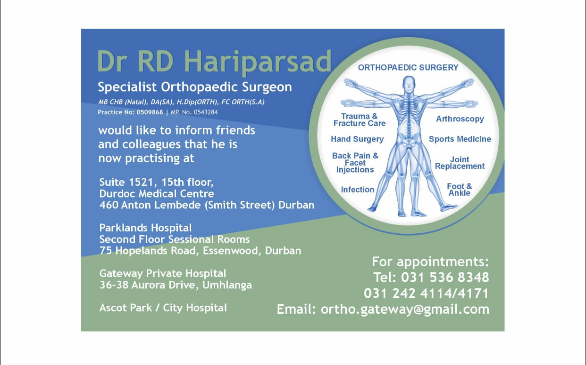

# Dr. RD Hariparsad - Orthopaedic Surgeon Website

## Overview
This is the official website for Dr. RD Hariparsad, a distinguished orthopaedic surgeon based in Durban, South Africa. The website showcases Dr. Hariparsad's professional services, qualifications, practice locations, and provides a platform for patients to get in touch.

## Features
- **Responsive Design**: Fully optimized for mobile, tablet, and desktop devices
- **Modern UI**: Clean, professional interface with smooth animations
- **Key Sections**:
  - About Dr. Hariparsad with professional biography
  - Comprehensive services offered
  - FAQ section for common patient questions
  - Practice locations with interactive maps
  - Contact form and information
- **Performance Optimized**: Fast loading times with lazy loading for images
- **SEO Friendly**: Proper meta tags, structured data, and semantic HTML

## Technologies Used
- HTML5, CSS3, JavaScript
- [Bootstrap Icons](https://icons.getbootstrap.com/)
- [Google Fonts](https://fonts.google.com/) (Poppins)
- [AOS Library](https://michalsnik.github.io/aos/) for scroll animations
- Responsive design with CSS Grid and Flexbox

## Setup
No special setup is required as this is a static website. Simply deploy the `index.html` file along with the associated assets (images, etc.) to any web hosting service.

## Assets Required
For full functionality, you'll need these image files in the same directory:
- `dr_hariparsad_logo.jpg` (Practice logo)
- `dr_hariparsad_portrait.png` (Doctor's profile image)
- `hero.jpeg` (Hero section background)
- `favicon.jpeg` (Browser tab icon)
- `favicon(spinner).jpeg` (Loading spinner image)

## Deployment
The website can be deployed to any standard web hosting service. For optimal performance, consider:
- Using a CDN for global content delivery
- Enabling GZIP compression
- Implementing browser caching

## Maintenance
To update content:
1. Edit the `index.html` file directly
2. Update any images by replacing the files (keep the same names)
3. For major changes, consider version control

## Credits
Website developed by [Spectra Studios](https:spectrastudios.co.za)

## License
This website is the property of Dr. RD Hariparsad and Spectra Studios. All content is copyrighted.
